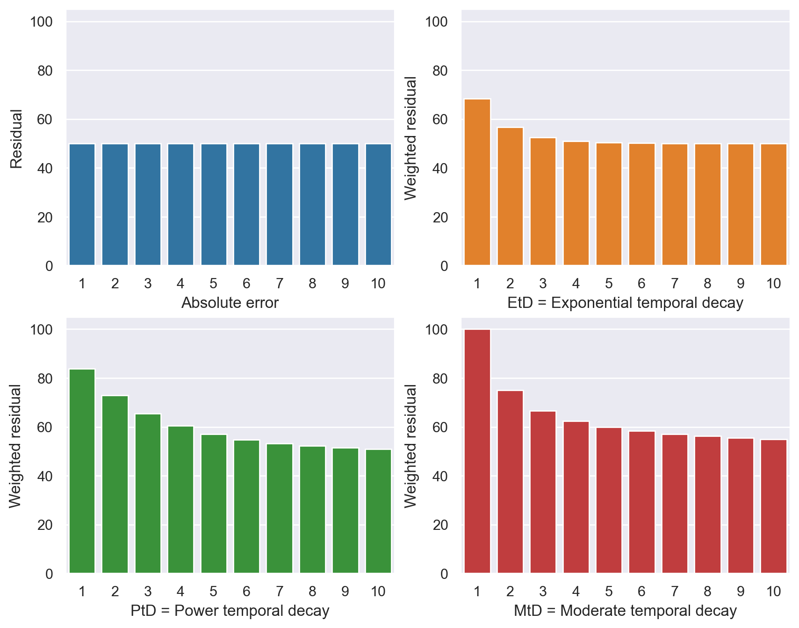

<b>Work in progress:</b> Recently, my paper _Remaining cycle time prediction: Temporal loss functions and prediction consistency_ got accepted for publication in Nordic Machine Intelligence (NMI). The paper addresses the issue of improving the performance from the so-called _earliness_ aspect by introducing a temporally-weighted penalty to the loss function.

## Loss functions vs. time

