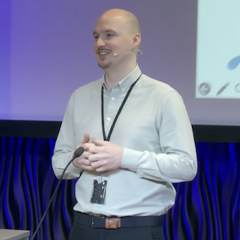

I am a Senior Research Scientist at Telenor Research, specializing in Business Analytics and AI within the telecommunications sector. 

My research concentrates on the evaluation of applied AI in business processes from three key perspectives: process monitoring, process optimization, and process automation.

I hold a PhD in Economics and Business Administration with a specialized focus on predictive and prescriptive process monitoring from the Norwegian University of Life Sciences (NMBU). Additionally, I obtained my MSc in Business Intelligence and BSc in Business Administration from Aarhus University, Denmark.

For further details, please refer to my [LinkedIn profile](https://www.linkedin.com/in/mike-riess-phd-8ba5796b/).

Best, 
Mike

