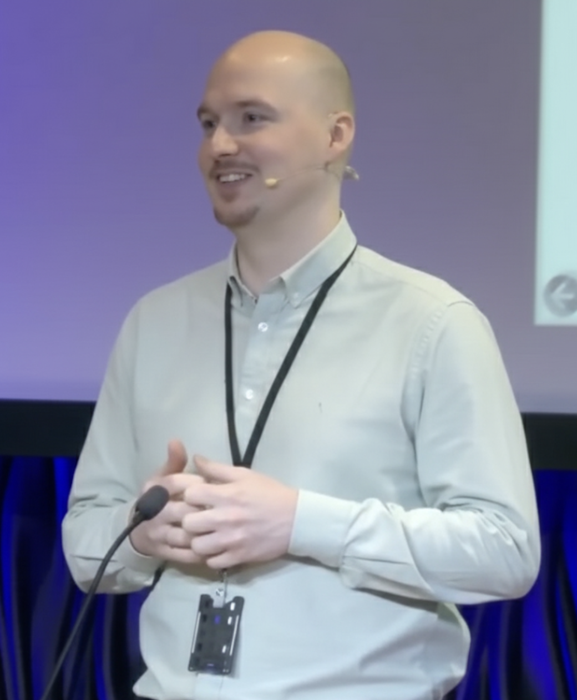

---
layout: page
mathjax: true
title:  "Mike Riess"
--- 
I'm a Senior Research Scientist at Telenor Research, working with Business Analytics and AI within the telcommunications sector. I did my PhD on predictive and prescriptive process monitoring at NMBU in Norway, my Msc. in Business Intelligence and Bsc. in Business Administration at Aarhus University in Denmark. 

Academically, I like to work on the evaluation aspects of applied AI in business processes. In my previous research on predictive process monitoring, I have been focusing on timeliness and (in)consistent behavior of remaining time prediction models. In prescriptive process monitoring, I have so far been focusing on the scheduling aspect (queue management) in customer service settings.

Feel free to visit my research <a href="https://mikeriess.github.io/blog/">blog</a>, which i _hope_ to keep as updated as my <a href="https://www.linkedin.com/in/mike-riess-phd-8ba5796b/">Linkedin</a> profile.

Best, 
Mike

